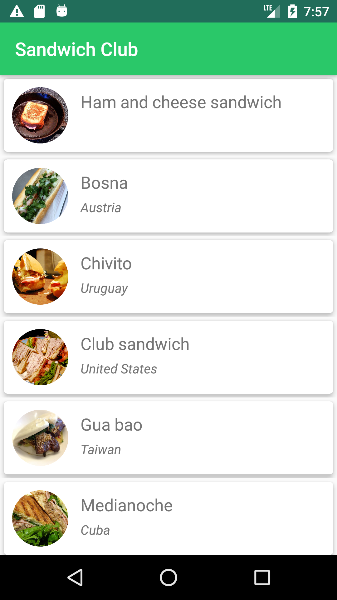
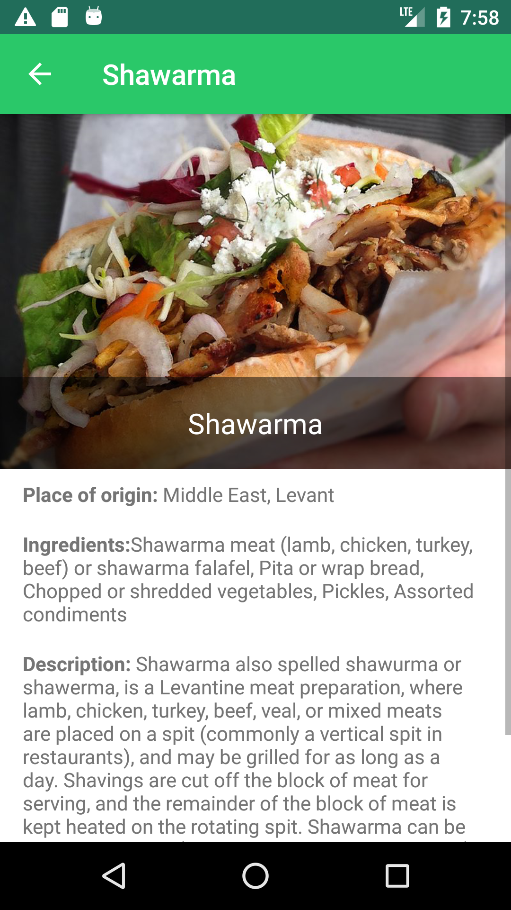

# Sandwich Club Project

In this project, you will complete the **Sandwich Club** app to show the details of each sandwich once it is selected.

## Table of contents
  * [General info](#general-info)
  * [Rubric](#rubric)
  * [Screenshots](#screenshots)
  * [Versioning and dependencies](#versioning-and-dependencies)

## General info
This is the first project of the Udacity Android Developer Nanodegree Program.

## Rubric

#### Common Project Requirements

| CRITERIA  | MEETS SPECIFICATIONS  |
|---|---|
| App is written solely in the Java Programming Language  | App is written solely in the Java Programming Language |
| App conforms to common standards found in the Android Nanodegree General Project Guidelines NOTE: It is okay if the app does not handle rotation properly or does not restore the data using onSaveInstanceState/onRestoreInstanceState) | App conforms to common standards found in the Android Nanodegree General Project Guidelines NOTE: It is okay if the app does not handle rotation properly or does not restore the data using onSaveInstanceState/onRestoreInstanceState) |   |
| Submission must use stable release versions of all libraries, Gradle, and Android Studio. Debug/beta/canary versions are not acceptable.  | App utilizes stable release versions of all libraries, Gradle, and Android Studio.  |

#### Core Functionality

| CRITERIA  |  MEETS SPECIFICATIONS |
|---|---|
| JSON data is parsed correctly to a Sandwich object in JsonUtils | JSON data is parsed correctly to a Sandwich object in JsonUtils  |
| JSON is parsed without using 3rd party libraries | JSON is parsed without using 3rd party libraries  |
| DetailActivity shows all Sandwich details correctly | DetailActivity shows all Sandwich details correctly |
| Detail layout includes a ScrollView so all the details are visible in small screen devices  | Detail layout includes a ScrollView so all the details are visible in small screen devices |
| Sandwich details are shown in a sensible layout. For example, ingredients appear next to the ingredients label | Sandwich details are shown in a sensible layout. For example, ingredients appear next to the ingredients label |

## Screenshots
| Main Activity - List of sandwiches | Detail Activity |
| :---: | :---: |
|  |  |

## Versioning and dependencies

**Target SDK Version:** 29

**Gradle Version:** 3.6.3

**Dependencies:**
- androidx.appcompat:appcompat:1.1.0
- androidx.recyclerview:recyclerview:1.1.0
- androidx.cardview:cardview:1.0.0
- com.squareup.picasso:picasso:2.5.2
- jp.wasabeef:picasso-transformations:2.2.1

**Android Studio Version:** 3.6.3 (Stable Release)

 
